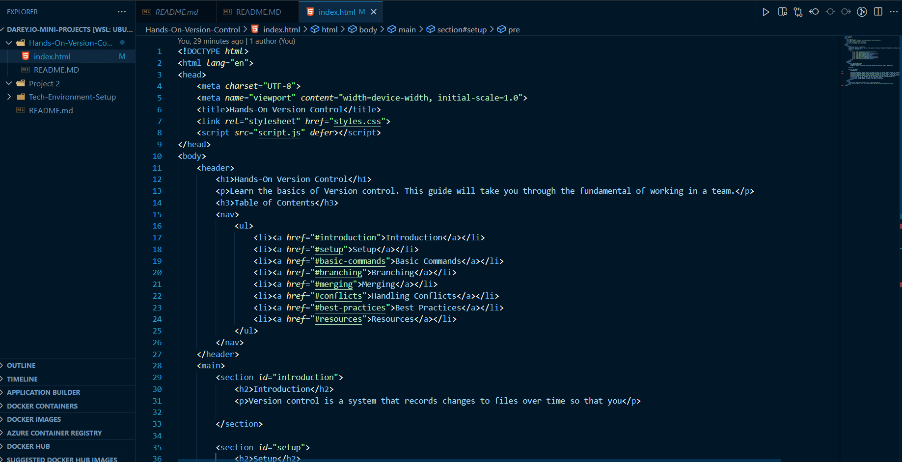
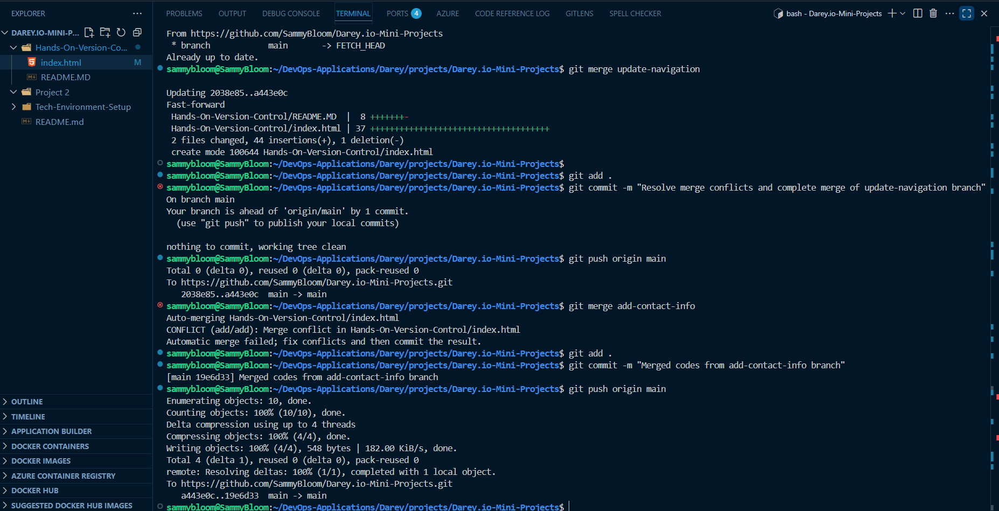
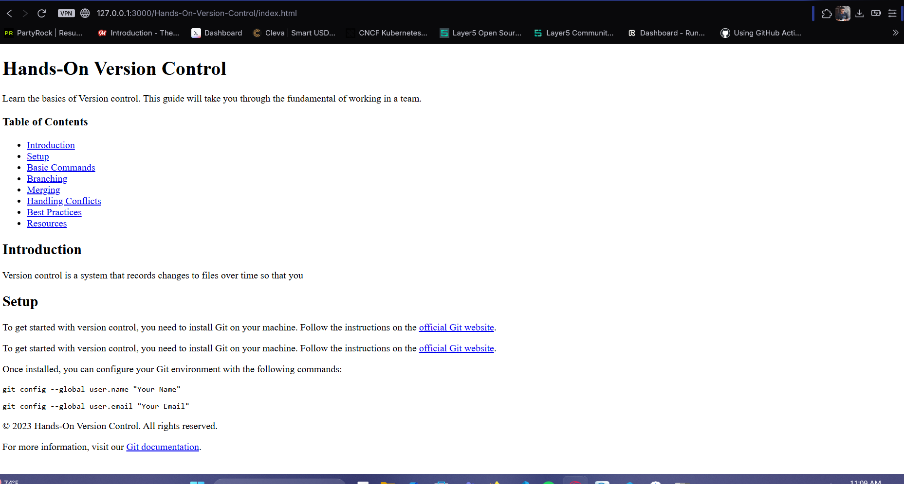
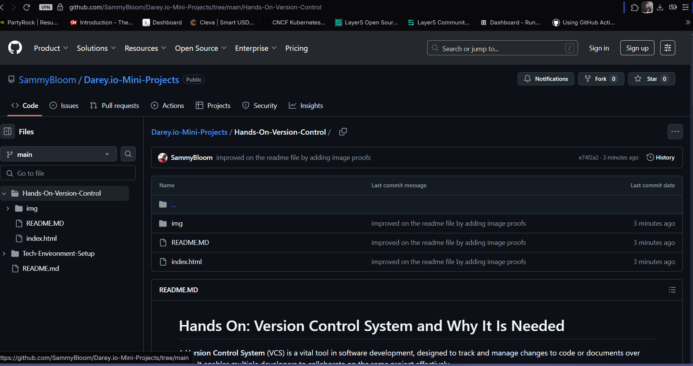

# Hands On: Version Control System and Why It Is Needed

A **Version Control System** (VCS) is a vital tool in software development, designed to track and manage changes to code or documents over time. It enables multiple developers to collaborate on the same project effectively.

## Real-Life Scenario

If a member "_Tom_" makes changes to the home page file "_index.html_" to update the navigation and at the same time, another team member "_Jerry_" makes changes to add contact information to the footer of the same home page thereby editing the same index.html file. Without VCS, the last person to upload their version of the file to the shared folder or server would overwrite the other person's changes, resulting in lost work.

### Solution

1. Tom and Jerry create new branches from **_main_** named **_update-navigation_** and **_add-contact-info_** respectively.

2. They both make changes to their code base.

3. Each pulls code from **_main_** and creates a **Pull Request**. Then a team lead reviews the code and merges to main. **OR** Each of them pulls code from **_main_**.

4. Changes are merged, committed and pushed to **_main_**.

The result is the web page below:

GitHub repo dashboard

The github url of the repository used is found [here](https://github.com/SammyBloom/Darey.io-Mini-Projects/tree/main/Hands-On-Version-Control).
[https://github.com/SammyBloom/Darey.io-Mini-Projects/tree/main/Hands-On-Version-Control](https://github.com/SammyBloom/Darey.io-Mini-Projects/tree/main/Hands-On-Version-Control).